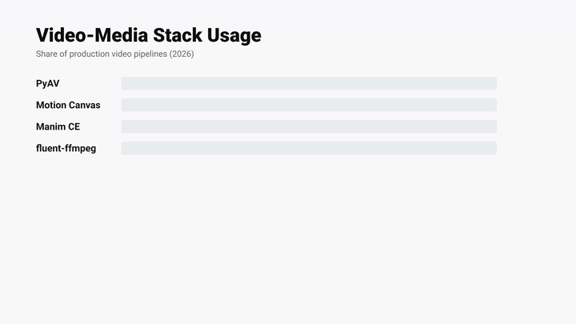

# 🎬 Video & Media

> Libraries and tools for video processing, playback, programmatic generation, and media pipelines.

---

## Players & Playback

---

## FFmpeg

| Field | Value |
|-------|-------|
| **Link** | [ffmpeg.org](https://ffmpeg.org) |
| **Use Case** | Transcoding, thumbnail generation, stream processing, pipeline glue |
| **Radar** | 🟢 Adopt |
| **Status** | Production-ready |

**Pros:**
- Universal codec support (H.264, H.265, VP9, AV1, ProRes, WebM)
- Runs anywhere — Linux, macOS, Docker, Cloud Run, Lambda
- Powerful filter graph for compositing, scaling, colour grading

**Cons:**
- CLI-only — wrap with fluent-ffmpeg (Node) or subprocess (Python)
- Filter graph syntax is complex for advanced pipelines

---

## fluent-ffmpeg

| Field | Value |
|-------|-------|
| **Link** | [github.com/fluent-ffmpeg/node-fluent-ffmpeg](https://github.com/fluent-ffmpeg/node-fluent-ffmpeg) |
| **Use Case** | Node.js declarative FFmpeg wrapper for clip assembly, transcoding, audio muxing |
| **Radar** | 🟢 Adopt |
| **Status** | Production-ready |

**Pros:**
- Chainable API, readable filter graph construction
- Full FFmpeg filter access without raw CLI strings
- Works well in serverless (Cloud Run, Lambda)

**Cons:**
- Requires FFmpeg binary at runtime (not self-contained)
- No frame-level pixel access — combine with PyAV or Canvas for generation

---

## Video.js

| Field | Value |
|-------|-------|
| **Link** | [videojs.com](https://videojs.com) |
| **Use Case** | Web video player, HLS/DASH playback, custom UI skin |
| **Radar** | 🟢 Adopt |
| **Status** | Production-ready |

**Pros:**
- Largest community of any open-source HTML5 player
- Rich plugin ecosystem (ads, analytics, thumbnails, chapters)
- HLS/DASH via hls.js / videojs-contrib-eme

**Cons:**
- Heavier than Plyr for simple use cases
- Default skin needs heavy CSS override for custom branding

---

## Plyr

| Field | Value |
|-------|-------|
| **Link** | [plyr.io](https://plyr.io) |
| **Use Case** | Lightweight customisable HTML5/YouTube/Vimeo player |
| **Radar** | 🟡 Trial |
| **Status** | Exploring |

**Pros:**
- Very clean API, easy to brand
- YouTube and Vimeo embeds work out of the box
- Small bundle size

**Cons:**
- Less mature HLS/DASH support than Video.js
- Smaller plugin ecosystem

---

## Shaka Player

| Field | Value |
|-------|-------|
| **Link** | [github.com/shaka-project/shaka-player](https://github.com/shaka-project/shaka-player) |
| **Use Case** | Adaptive streaming (HLS/DASH), DRM (Widevine, PlayReady, FairPlay) |
| **Radar** | 🟡 Trial |
| **Status** | Exploring |

**Pros:**
- Best-in-class DASH + DRM support (Google-backed)
- Handles live streams and low-latency DASH
- Works with Chromecast and media sessions

**Cons:**
- Overkill for simple VOD without DRM
- Larger learning curve than Video.js for basic use

---

## Remotion

> ⚠️ **Commercial licence required for SaaS** — see [remotion.dev/license](https://remotion.dev/license)

| Field | Value |
|-------|-------|
| **Link** | [remotion.dev](https://remotion.dev) |
| **Use Case** | Programmatic video generation with React components |
| **Radar** | 🔴 Hold |
| **Status** | Exploring |
| **Licence** | ⚠️ Remotion Company Licence — **NOT free for server-side SaaS rendering** |

**Pros:**
- React-first — if your team knows React, productivity is high
- Strong TypeScript support, excellent DX and docs
- Remotion Studio for browser-based preview with frame scrubbing

**Cons:**
- ⚠️ **Server-side rendering in a SaaS product requires a paid Company Licence ($1,500+/yr)** — this applies even if the product is free to end users
- The licence exception for "internal tools" does not cover customer-facing video generation
- Headless render requires Chromium — heavy in serverless (Lambda/Cloud Run)
- Use **Motion Canvas** (MIT) or **Revideo** (MIT) as free alternatives

---

## MediaPipe

| Field | Value |
|-------|-------|
| **Link** | [mediapipe.dev](https://mediapipe.dev) |
| **Use Case** | Real-time ML on video: pose estimation, face mesh, hand tracking, object detection |
| **Radar** | 🟡 Trial |
| **Status** | Exploring |

**Pros:**
- Cross-platform (Web WASM, Python, Android, iOS)
- Pre-trained models, no GPU needed for many tasks
- Low latency on-device inference

**Cons:**
- Model selection limited to what Google ships
- WASM performance lower than native for complex pipelines

---

## Programmatic Video Generation

> Free, licence-safe libraries for generating video programmatically — no commercial licence fees.
> Full comparison: [programmatic-video-tools](projects/programmatic-video-tools.md)

---

## PyAV

| Field | Value |
|-------|-------|
| **Link** | [pyav.org](https://pyav.org) |
| **Use Case** | Frame-by-frame H.264/H.265 video encoding from Python (PIL, NumPy, Skia) |
| **Radar** | 🟢 Adopt |
| **Status** | Production-ready |

**Pros:**
- Full FFmpeg codec stack from Python — H.264, H.265, VP9, AV1, ProRes
- GPU encode via NVENC / VideoToolbox
- Mux video + audio in one pass, no subprocess overhead
- Frame-accurate timing, sub-millisecond pts control

**Cons:**
- No animation abstraction — build scenes yourself with PIL/NumPy/Skia
- Steep learning curve (libav C API surface)

---

## MoviePy

| Field | Value |
|-------|-------|
| **Link** | [zulko.github.io/moviepy](https://zulko.github.io/moviepy/) |
| **Use Case** | Clip compositing, text overlays, watermarking, trimming existing videos |
| **Radar** | 🟢 Adopt |
| **Status** | Production-ready |

**Pros:**
- Intuitive clip API: `VideoFileClip`, `concatenate_videoclips`, `CompositeVideoClip`
- Built-in text, image, and audio clip support
- Great for post-processing PyAV or Manim renders

**Cons:**
- Slower than PyAV for pure generation (Python frame loop)
- v2.x API partially breaking from v1.x

---

## Manim CE

| Field | Value |
|-------|-------|
| **Link** | [manim.community](https://www.manim.community/) |
| **Use Case** | Math animations, diagram explainers, data storytelling — publication quality |
| **Radar** | 🟢 Adopt |
| **Status** | Production-ready |

**Pros:**
- Declarative scene graph — describe what, not how
- Perfect LaTeX + MathTex integration
- Smooth interpolation on all geometric primitives
- Community Edition is MIT — no licence cost

**Cons:**
- Full LaTeX dependency (~1.5 GB install)
- Slow render for long scenes — not real-time
- Steep mental model for non-math content

---

## Motion Canvas

| Field | Value |
|-------|-------|
| **Link** | [motioncanvas.io](https://motioncanvas.io) |
| **Use Case** | TypeScript declarative animations for product demos, SaaS onboarding, explainers |
| **Radar** | 🟢 Adopt |
| **Status** | Production-ready |

**Pros:**
- Generator-based timeline (`yield*`) — complex sequences stay readable
- First-class TypeScript + JSX for scene composition
- Real-time browser preview, hot reload, export to MP4
- MIT licence, no commercial restrictions

**Cons:**
- Node.js only
- Smaller community than Manim / Three.js

---

## Three.js

| Field | Value |
|-------|-------|
| **Link** | [threejs.org](https://threejs.org) |
| **Use Case** | GPU-accelerated 3D scenes, product reveals, data globes — captured via Puppeteer |
| **Radar** | 🟢 Adopt |
| **Status** | Production-ready |

**Pros:**
- Hardware WebGL rendering — smooth 3D at 60+ fps
- Massive ecosystem: shaders, physics (Cannon-es), post-processing
- GLTF model loading, PBR materials, environment maps

**Cons:**
- Headless video export requires Puppeteer + CDP frame capture
- WebGL in CI needs `xvfb` or `--use-gl=egl` flag

---

## D3.js

| Field | Value |
|-------|-------|
| **Link** | [d3js.org](https://d3js.org) |
| **Use Case** | Animated SVG/Canvas data charts — bar race, time series, geographic maps |
| **Radar** | 🟢 Adopt |
| **Status** | Production-ready |

**Pros:**
- Unmatched control over data-bound SVG
- Transition API for smooth animated charts
- Huge ecosystem: Observable, D3-force, D3-geo, D3-sankey

**Cons:**
- Low-level — you construct every visual element manually
- SVG animations limited to ~60 fps; use Canvas for higher fps

---

## Anime.js

| Field | Value |
|-------|-------|
| **Link** | [animejs.com](https://animejs.com) |
| **Use Case** | DOM/SVG/CSS animations for UI mockups and web capture pipelines |
| **Radar** | 🟢 Adopt |
| **Status** | Production-ready |

**Pros:**
- Chainable timeline API, very readable
- Supports CSS, SVG, DOM, and plain JS object animation
- Tiny bundle (~17 KB)

**Cons:**
- No WebGL/3D — use Three.js or PixiJS for that
- Relies on browser render — needs Puppeteer for MP4 export

---

## PixiJS

| Field | Value |
|-------|-------|
| **Link** | [pixijs.com](https://pixijs.com) |
| **Use Case** | WebGL 2D renderer for sprite-heavy scenes, dashboards, particle systems |
| **Radar** | 🟢 Adopt |
| **Status** | Production-ready |

**Pros:**
- WebGL batching: thousands of sprites at 60+ fps
- GPU filters (blur, glow, CRT effect) as shaders
- Spine animation integration

**Cons:**
- No built-in video export — requires Puppeteer headless capture
- Overkill for simple text animations

---

## Revideo

| Field | Value |
|-------|-------|
| **Link** | [re.video](https://re.video) |
| **Use Case** | Data-driven bulk video generation at scale (Motion Canvas fork with cloud render) |
| **Radar** | 🟡 Trial |
| **Status** | Exploring |

**Pros:**
- Motion Canvas-compatible API (shared primitives)
- Built-in cloud render queue for N videos from a dataset
- TypeScript-first, MIT runtime

**Cons:**
- Younger project, API still evolving
- Cloud pricing model not finalised

---

## HyperFrames

| Field | Value |
|-------|-------|
| **Link** | [github.com/heygen-com/hyperframes](https://github.com/heygen-com/hyperframes) |
| **Use Case** | Write plain HTML + CSS/GSAP, render deterministic MP4/WebM via headless Chrome + FFmpeg. Agent-friendly non-interactive CLI. |
| **Radar** | 🟡 Trial |
| **Status** | Exploring |
| **Licence** | Apache 2.0 |

**Pros:**
- HTML-native — no proprietary DSL or React compiler. `data-start`, `data-duration`, `data-track-index` attributes drive the timeline; a `window.__timelines[id]` GSAP timeline drives animation.
- `npx hyperframes init` → working project in one command. Ships `doctor`, `lint`, `snapshot`, `render`, `preview` subcommands — all non-interactive, composable in CI.
- Parallel frame capture (8 Chrome workers on 16 cores rendered 5s @ 1080p30 in **7.1s** in my test) — faster than single-process Puppeteer capture.
- Linter caught a real issue (`missing_timeline_registry`) in one of my test compositions.
- Apache 2.0 — no commercial gotcha like Remotion.
- First-class agent story: `hyperframes skills` drops AGENTS.md / CLAUDE.md guides into the project.

**Cons:**
- Pulls a ~110 MB Chrome Headless Shell on first run (`hyperframes browser ensure`) — heavy for ephemeral CI runners; cache the `~/.cache/hyperframes/chrome` path.
- CDN `<script>` tags (e.g. GSAP from jsdelivr) failed in my sandboxed network — render continued but animation silently didn't run. **Bundle animation libs locally** (`./vendor/gsap.min.js`) to be safe in airgapped / restricted networks.
- `render -o out.mp4` short flag errored with `Not a directory`; `--output out.mp4` works. Minor CLI parsing bug in v0.4.6.
- Linter flags `missing_timeline_registry` even for pure CSS `@keyframes` compositions that don't need a GSAP timeline — render still succeeds (non-strict by default) but the warning is a false positive for CSS-only scenes.
- Young project (v0.4.6 at test time) — expect API churn.

**Tested Example 1 — animated title card (GSAP):**


_Rendered MP4: [`samples/hyperframes/01-title-card-gsap.mp4`](samples/hyperframes/01-title-card-gsap.mp4) — 1920×1080 · H.264 · 30fps · 5s · 228 KB_

```html
<!-- index.html -->
<!doctype html>
<html>
  <head>
    <meta name="viewport" content="width=1920, height=1080" />
    <script src="./vendor/gsap.min.js"></script>
    <style>
      html, body { width: 1920px; height: 1080px; background: #0f172a; }
      .stage { display: flex; align-items: center; justify-content: center; height: 100%; flex-direction: column; }
      .title { font-size: 140px; font-weight: 800; color: #f8fafc; }
      .accent { color: #60a5fa; }
    </style>
  </head>
  <body>
    <div id="root" data-composition-id="main" data-start="0" data-duration="5" data-width="1920" data-height="1080">
      <div class="stage clip" data-start="0" data-duration="5" data-track-index="1">
        <div class="title">
          <span id="w1">Render</span>
          <span id="w2" class="accent">video</span>
          <span id="w3">from HTML</span>
        </div>
      </div>
    </div>
    <script>
      const tl = gsap.timeline({ paused: true });
      tl.from("#w1", { opacity: 0, y: 40, duration: 0.5 }, 0.3);
      tl.from("#w2", { opacity: 0, y: 40, duration: 0.5 }, 0.5);
      tl.from("#w3", { opacity: 0, y: 40, duration: 0.5 }, 0.7);
      window.__timelines = { main: tl };
    </script>
  </body>
</html>
```

```bash
npx hyperframes lint                    # 0 errors, 0 warnings
npx hyperframes render --output out.mp4 # 150 frames, 227 KB, 7.1s wall-clock
```

**Tested Example 2 — animated bar chart (pure CSS, no GSAP):**



_Rendered MP4: [`samples/hyperframes/02-bar-chart-css.mp4`](samples/hyperframes/02-bar-chart-css.mp4) — 1920×1080 · H.264 · 30fps · 6s · 102 KB_

```html
<div id="root" data-composition-id="main" data-start="0" data-duration="6"
     data-width="1920" data-height="1080">
  <div class="stage clip" data-start="0" data-duration="6" data-track-index="1">
    <h1>Video-Media Stack Usage</h1>
    <div class="row r1">
      <div class="label">PyAV</div>
      <div class="track"><div class="bar" style="--w: 92%"></div></div>
      <div class="value">92%</div>
    </div>
    <!-- ... more rows ... -->
  </div>
</div>

<style>
  .bar { width: 0; animation: grow 1.6s cubic-bezier(0.16, 1, 0.3, 1) forwards; }
  .r1 .bar { background: linear-gradient(90deg, #3b82f6, #60a5fa); animation-delay: 0.3s; }
  @keyframes grow { to { width: var(--w); } }
</style>
```

```bash
npx hyperframes render --output out.mp4
# ✗ missing_timeline_registry: Missing `window.__timelines` registration.  ← false positive for CSS-only
# Render continues → 180 frames, 102 KB, 7.3s
```

**Honest verdict:**

Slotted between Motion Canvas and Remotion. If your designers / agents already speak HTML+CSS and you want MP4 out without React or a $1,500/yr commercial licence, HyperFrames is the cleanest path I've tested. The agent-first CLI (every command works non-interactively, with `--quiet`, `--strict`, JSON-ish output) is genuinely well-designed for Claude-Code / Cursor pipelines. Not yet production-ready for me — the CDN-blocking and linter false-positive burn time — but a strong **🟡 Trial** to revisit at v1.0.

---

## Skia-Python

| Field | Value |
|-------|-------|
| **Link** | [kyamagu.github.io/skia-python](https://kyamagu.github.io/skia-python/) |
| **Use Case** | Chrome-quality 2D vector rendering from Python — pipe frames to PyAV |
| **Radar** | 🟡 Trial |
| **Status** | Exploring |

**Pros:**
- Same rendering engine as Chrome (Google Skia)
- Excellent font shaping via HarfBuzz
- GPU-accelerated via Metal/Vulkan backend

**Cons:**
- Heavy binary (~200 MB)
- Less documented than Pillow for basic tasks
- No built-in video output — combine with PyAV

---

## Vispy

| Field | Value |
|-------|-------|
| **Link** | [vispy.org](https://vispy.org) |
| **Use Case** | OpenGL scientific visualisation: point clouds, volume renders, real-time data |
| **Radar** | 🟡 Trial |
| **Status** | Exploring |

**Pros:**
- Renders millions of points at 60+ fps via GPU
- Good for geospatial and scientific data
- Python API

**Cons:**
- Requires a display (Xvfb in CI)
- Scene API dated vs Three.js

---

## Movis

| Field | Value |
|-------|-------|
| **Link** | [github.com/rezoo/movis](https://github.com/rezoo/movis) |
| **Use Case** | After Effects-style layer compositing in Python |
| **Radar** | 🟡 Trial |
| **Status** | Exploring |

**Pros:**
- Layer-based timeline with easing functions
- Simple API — accessible to non-video engineers

**Cons:**
- Small community, slow development cadence
- Performance limited by Python frame loop

---

## GStreamer

| Field | Value |
|-------|-------|
| **Link** | [gstreamer.freedesktop.org](https://gstreamer.freedesktop.org) |
| **Use Case** | Broadcast-grade real-time video pipelines, embedded targets, GPU encode |
| **Radar** | 🟡 Trial |
| **Status** | Exploring |

**Pros:**
- Production multimedia framework used in broadcast and embedded
- GPU encode: NVENC, V4L2, VAAPI
- Runs on Jetson, Raspberry Pi, x86 alike

**Cons:**
- Complex pipeline DSL
- Python bindings (pygobject) are verbose
- Poor Windows support

---

## Matplotlib Animation

| Field | Value |
|-------|-------|
| **Link** | [matplotlib.org/stable/api/animation_api.html](https://matplotlib.org/stable/api/animation_api.html) |
| **Use Case** | Quick animated chart exports from existing Matplotlib plots |
| **Radar** | 🟡 Trial |
| **Status** | Exploring |

**Pros:**
- Zero extra dependencies if Matplotlib already in stack
- `FuncAnimation` + `FFMpegWriter` — simple path to MP4

**Cons:**
- Slow render (CPU-only Python frame loop)
- No compositing or text overlay beyond Matplotlib primitives

---

## Lottie-Web

| Field | Value |
|-------|-------|
| **Link** | [airbnb.io/lottie](https://airbnb.io/lottie/#/) |
| **Use Case** | Render After Effects JSON animations in browser — micro-animations, loaders |
| **Radar** | 🟡 Trial |
| **Status** | Exploring |

**Pros:**
- Designer-friendly (AE → Bodymovin → JSON workflow)
- Tiny runtime, transparent video support
- Works headless via Puppeteer for MP4 export

**Cons:**
- Dependent on designer AE toolchain
- Complex animations lose fidelity in JSON conversion

---

## p5.js

| Field | Value |
|-------|-------|
| **Link** | [p5js.org](https://p5js.org) |
| **Use Case** | Generative art, creative coding sketches, educational animations |
| **Radar** | 🟡 Trial |
| **Status** | Exploring |

**Pros:**
- Very beginner-friendly API
- Large creative coding community
- Canvas + WebGL modes

**Cons:**
- LGPL-2.1 — disclosure required in commercial products
- Not optimised for production video pipelines

---

## Rive

| Field | Value |
|-------|-------|
| **Link** | [rive.app](https://rive.app) |
| **Use Case** | State machine animations (idle → hover → active) for interactive product UI |
| **Radar** | 🟡 Trial |
| **Status** | Exploring |

**Pros:**
- State machine model — animations respond to real data, not just time
- MIT runtime, small `.riv` binary files
- WASM runtime works in any JS environment

**Cons:**
- Editor is closed-source (runtime is MIT)
- Not designed for video export

---

## Editly

| Field | Value |
|-------|-------|
| **Link** | [github.com/mifi/editly](https://github.com/mifi/editly) |
| **Use Case** | Declarative JSON-defined video editing and clip assembly in Node.js |
| **Radar** | 🟡 Trial |
| **Status** | Exploring |

**Pros:**
- JSON spec → MP4 — zero code for simple clip assembly
- Built-in transitions, text overlays, audio mixing

**Cons:**
- Limited to built-in transitions and effects
- Slow for large batches vs fluent-ffmpeg

---

## LibOpenShot

| Field | Value |
|-------|-------|
| **Link** | [openshot.org](https://www.openshot.org/developers/) |
| **Use Case** | Python bindings to OpenShot video editor C++ engine |
| **Radar** | 🔴 Hold |
| **Status** | Exploring |

**Pros:**
- Powerful clip timeline engine

**Cons:**
- **LGPL-3** — linking restrictions complicate commercial SaaS
- Python API surface is fragile and poorly documented

---

## ProjectM

| Field | Value |
|-------|-------|
| **Link** | [github.com/projectM-visualizer/projectm](https://github.com/projectM-visualizer/projectm) |
| **Use Case** | MilkDrop-style audio-reactive generative visuals |
| **Radar** | 🔴 Hold |
| **Status** | Exploring |

**Pros:**
- GPU-accelerated generative visuals with audio input

**Cons:**
- **LGPL** — commercial use restrictions
- C++ heavy — no Python-friendly frame capture path

---

## Pytoon

| Field | Value |
|-------|-------|
| **Link** | [github.com/atomicshark/pytoon](https://github.com/atomicshark/pytoon) |
| **Use Case** | Experimental Python cartoon animation library |
| **Radar** | 🔴 Hold |
| **Status** | Exploring |

**Pros:**
- MIT licence

**Cons:**
- Pre-alpha — API unstable, no reliable release cadence
- No production usage evidence

---
